# Threat Hunt: NPT-WS01 Overnight Compromise

A guided threat-hunting exercise conducted in Microsoft Defender Advanced
Hunting, reconstructing a full attack chain — initial access through
lateral movement — from raw endpoint telemetry, then translating the
findings into a containment plan and incident report.

**Skills demonstrated:** KQL / Advanced Hunting · endpoint telemetry
analysis · process-tree reconstruction · C2 identification · persistence
mechanism analysis (registry, scheduled task, service) · MITRE ATT&CK
mapping · incident response & containment planning

---

## Scenario

> **Help Desk Ticket #4451** — Received 22 April 2026, 09:14 UTC
> Reporter: Mark Smith, Finance · Affected machine: NPT-WS01
>
> *"My machine was throwing login prompts at me through the night. I
> ignored it and went back to sleep. Seems fine this morning. Can someone
> take a look?"*

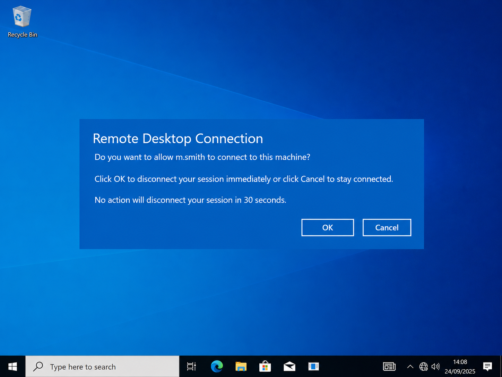

**Objective:** determine whether this was benign or a genuine compromise;
if real, reconstruct the full attack chain, scope the impact, and produce
an investigation report and containment plan.

**Tooling:** Microsoft Defender Portal, Advanced Hunting (KQL)
**Window analyzed:** 22 April 2026, 04:30–06:00 UTC
**Primary host:** `npt-ws01`

---

## Attack Chain at a Glance

```
External IP (20.110.92.50)
        │  network logon as "helpdesk"
        ▼
   NPT-WS01 ── wmiprvse.exe → cmd.exe → WindowsUpdate.exe (implant)
        │
        ├─ C2 beacon → updates.abordasync.website
        │
        ├─ Persistence ×3
        │     • Registry Run key: WindowsHealthCheck
        │     • Scheduled task:   GoogleUpdaterTask
        │     • Service:          WindowsHealthSvc
        │
        ├─ Backdoor account created: nexus_admin → local Administrators
        │
        └─ Lateral movement ──▶ NPT-SRV01
```

---

## Investigation Walkthrough

### 1 — Initial Access: the logon

**Question:** Which account did the attacker actually use?
**Table / column:** `DeviceLogonEvents.AccountName`

Filtering to successful logons in the window and isolating network-type
(LogonType 3) sessions surfaced a helpdesk-style account authenticating
interactively over the network — something that account has no legitimate
reason to do.

**Finding:** account `helpdesk`

**Skill:** Authentication events; recognising a suspicious logon.

```kql
let start_time = datetime(2026-04-22T02:00:00.00Z);
let end_time = datetime(2026-04-22T08:00:00.00Z);
let HostInQuestion = "npt-ws01";
DeviceLogonEvents
|where TimeGenerated between (start_time ..end_time)
|where DeviceName == HostInQuestion
|where ActionType contains "success"
```

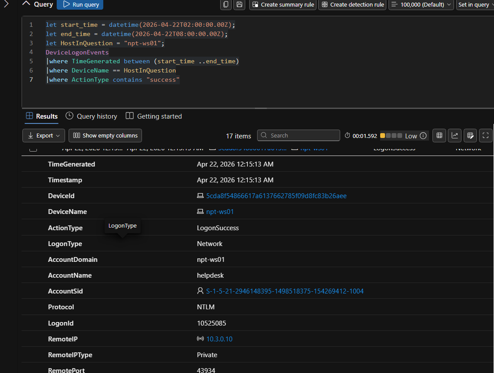

### 2 — Source of the intrusion

**Question:** Where did the attacker connect from?
**Table / column:** `DeviceLogonEvents.RemoteIP`

**Finding:** external IP `20.110.92.50`

**Skill:** Tying a logon to an external source address.

```kql
let start_time = datetime(2026-04-22T02:00:00.00Z);
let end_time = datetime(2026-04-22T08:00:00.00Z);
let HostInQuestion = "npt-ws01";
DeviceLogonEvents
|where TimeGenerated between (start_time ..end_time)
|where DeviceName == HostInQuestion
|where AccountName contains "helpdesk"
|where ActionType contains "success"
|where isnotempty( RemoteIP)
|project TimeGenerated, AccountName, RemoteIP, RemoteIPType
```

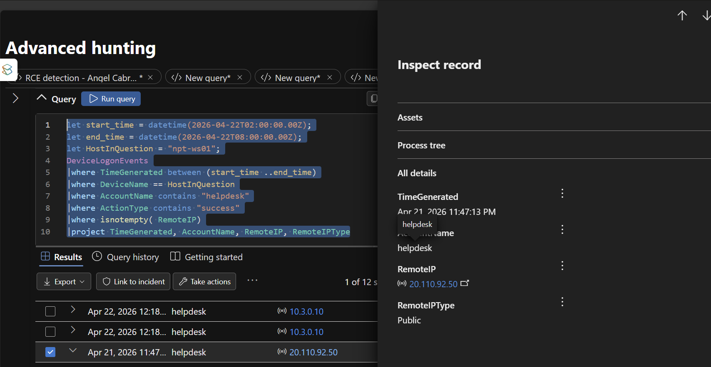

### 3 — Execution: launching the implant

**Question:** What command line launched the malicious payload?
**Table / column:** `DeviceProcessEvents.ProcessCommandLine`

Reviewing everything executed under the compromised account surfaced a
quiet `cmd.exe /Q /c start` command launching a binary out of
`C:\Windows\Temp\` — a signature pattern for Impacket's `wmiexec` module.

**Finding:** `cmd.exe /Q /c start "" "C:\Windows\Temp\WindowsUpdate.exe"`

**Skill:** Process execution and command-line analysis

```kql
let start_time = datetime(2026-04-22T02:00:00.00Z);
let end_time = datetime(2026-04-22T08:00:00.00Z);
let HostInQuestion = "npt-ws01";
DeviceProcessEvents
|where TimeGenerated between (start_time ..end_time)
|where DeviceName == HostInQuestion
|where AccountName == "helpdesk"
```

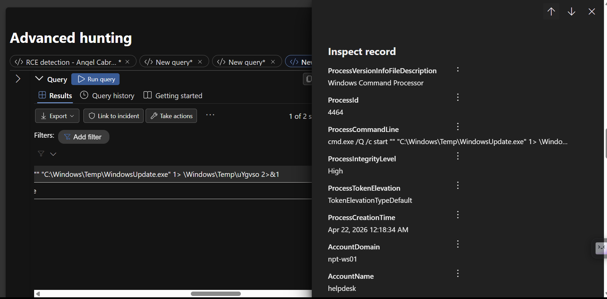

### 4 — Confirming remote execution

**Question:** What spawned that `cmd.exe`?
**Table / column:** `DeviceProcessEvents.InitiatingProcessFileName`

The immediate parent was `wmiprvse.exe` — the WMI provider host — which
confirms this was remote WMI-based execution rather than local, interactive
activity.

**Finding:** `wmiprvse.exe`

**Skill:** Parent-child process relationships; reconstructing the chain.

```kql
let start_time = datetime(2026-04-22T02:00:00.00Z);
let end_time = datetime(2026-04-22T08:00:00.00Z);
let HostInQuestion = "npt-ws01";
DeviceProcessEvents
|where TimeGenerated between (start_time ..end_time)
|where DeviceName == HostInQuestion
|where AccountName == "helpdesk"
```

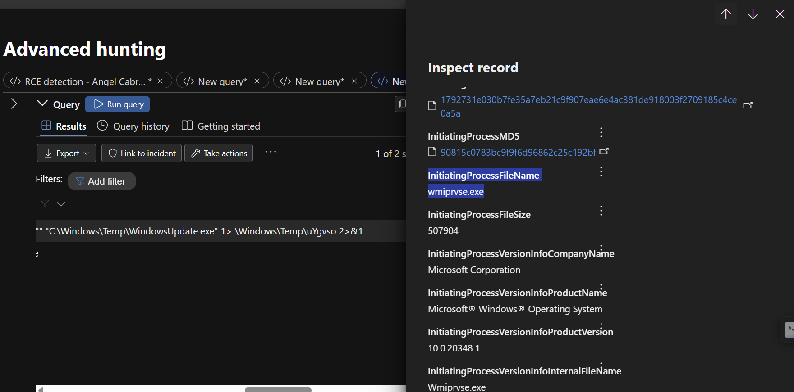

### 5 — Command & Control

**Question:** What domain did the host beacon to?
**Table / column:** `DeviceNetworkEvents.RemoteUrl`

Filtering outbound HTTPS traffic to non-Microsoft-signed processes and
excluding standard `*.microsoft.com` / `*.windows.com` / `*.azure.com`
noise isolated a single external domain, resolving to the same IP as the
initial logon.

**Finding:** `updates.abordasync.website`

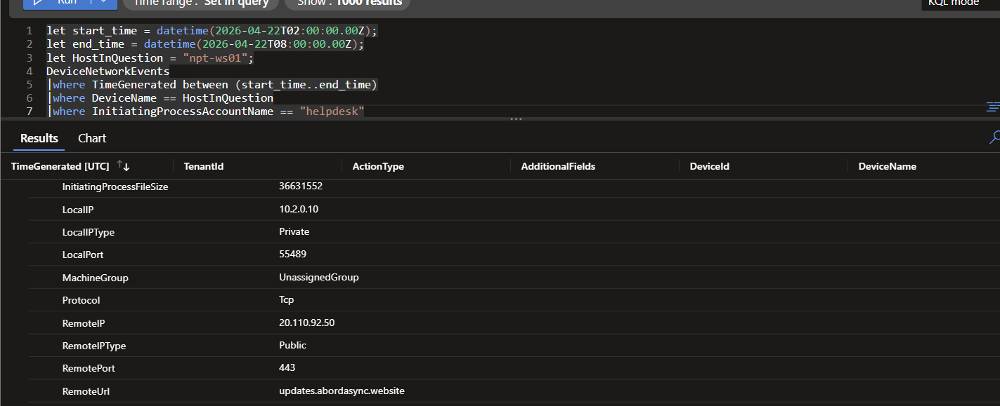

### 6 — The dropped file

**Question:** What was the implant, and what's its hash?
**Table / column:** `DeviceFileEvents.SHA256`

**Finding:** `20cef6a013953890f9d38605d25d60dd63b42b09946bbb18ddb4a456da306e77`
(written to `C:\Windows\Temp\WindowsUpdate.exe`)

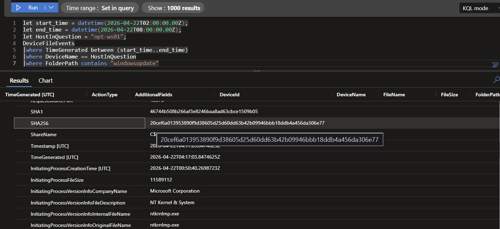

### 7 — Persistence: registry Run key

**Question:** What autostart mechanism did the attacker plant?
**Table / column:** `DeviceRegistryEvents.RegistryValueName`

**Finding:** Run key `WindowsHealthCheck`, disguised as a legitimate
health/update task and pointing back at the Temp-folder implant.

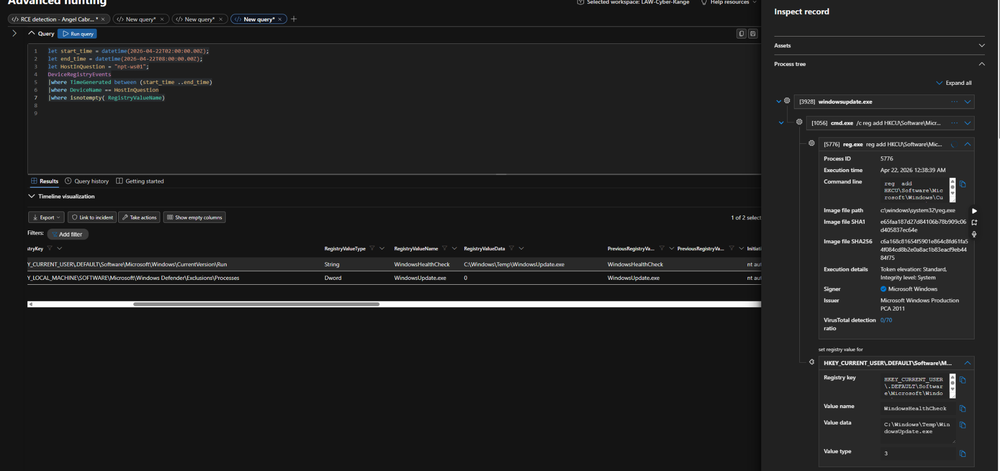

### 8 — Persistence: scheduled task

**Question:** What scheduled task backs up the persistence?
**Table / column:** `DeviceProcessEvents.ProcessCommandLine` (`/tn`)

**Finding:** `GoogleUpdaterTask` — named to impersonate a well-known
legitimate updater.

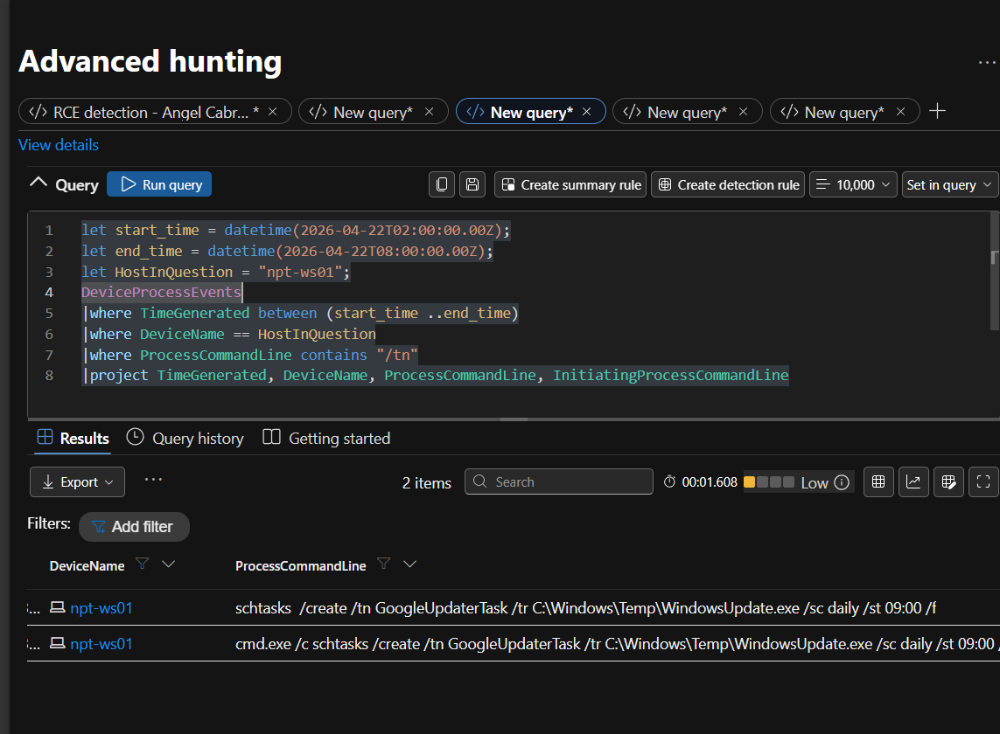

### 9 — Persistence: Windows service

**Question:** What service backs up the persistence further?
**Table / column:** `DeviceProcessEvents.ProcessCommandLine` (`sc.exe create`)

**Finding:** service `WindowsHealthSvc`, again masquerading as a Windows
health-monitoring component.

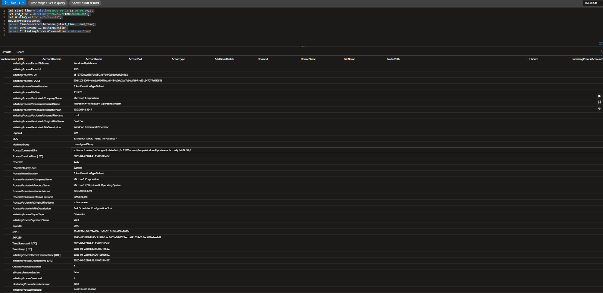

### 10 — Privilege escalation: backdoor account

**Question:** Did the attacker create their own account?
**Table / column:** `DeviceProcessEvents.ProcessCommandLine` (`net user ... /add`)

Two correlated events seconds apart — account creation, then addition to
Administrators — confirm a deliberate privilege-escalation step.

**Finding:** local account `nexus_admin`, added to local Administrators.

```kql
let start_time = datetime(2026-04-22T02:00:00.00Z);
let end_time = datetime(2026-04-22T08:00:00.00Z);
let HostInQuestion = "npt-ws01";
DeviceProcessEvents
|where TimeGenerated between (start_time ..end_time)
|where DeviceName == HostInQuestion
|where LogonId == "999"
|where ProcessCommandLine contains "net user"
|project TimeGenerated, DeviceName, ProcessCommandLine
```

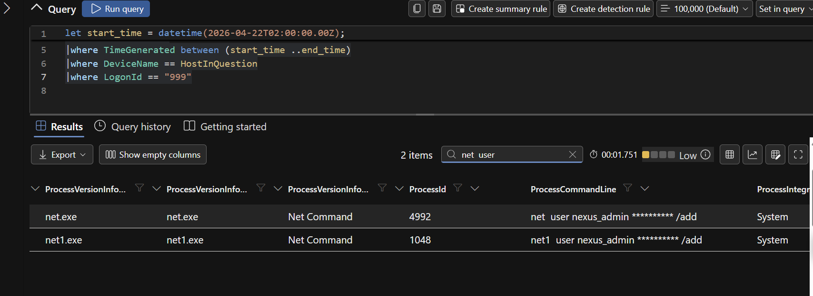

### 11 — Scoping: lateral movement

**Question:** Did the attacker move beyond the first host?
**Table / column:** `AlertEvidence` / `DeviceInfo.DeviceName`

Reviewing which hosts raised correlated alerts in the window identified a
second affected system on the same fleet.

**Finding:** `NPT-SRV01`

```kql
let start_time = datetime(2026-04-22T02:00:00.00Z);
let end_time = datetime(2026-04-22T08:00:00.00Z);
let HostInQuestion = "npt-ws01";
AlertEvidence
|where TimeGenerated between (start_time ..end_time)
|where isnotempty(DeviceName)
| join kind=inner (AlertInfo | where Timestamp between (start_time ..end_time)) on AlertId
| summarize AlertCount = count(),
            UniqueAlerts = dcount(AlertId),
            AlertTitles = make_set(Title)
          by DeviceName
| sort by AlertCount desc
```

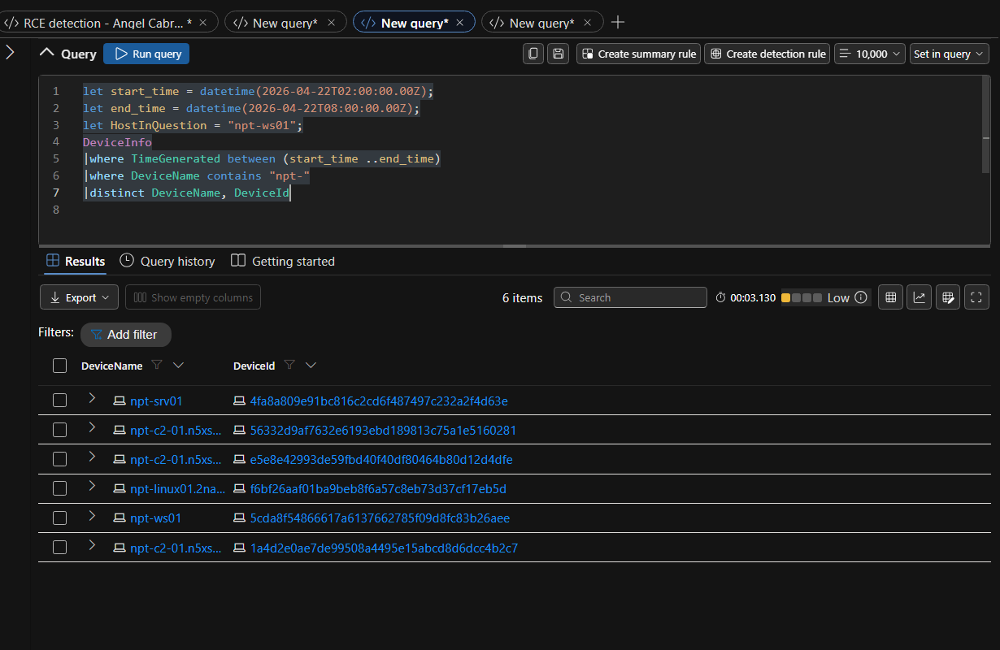
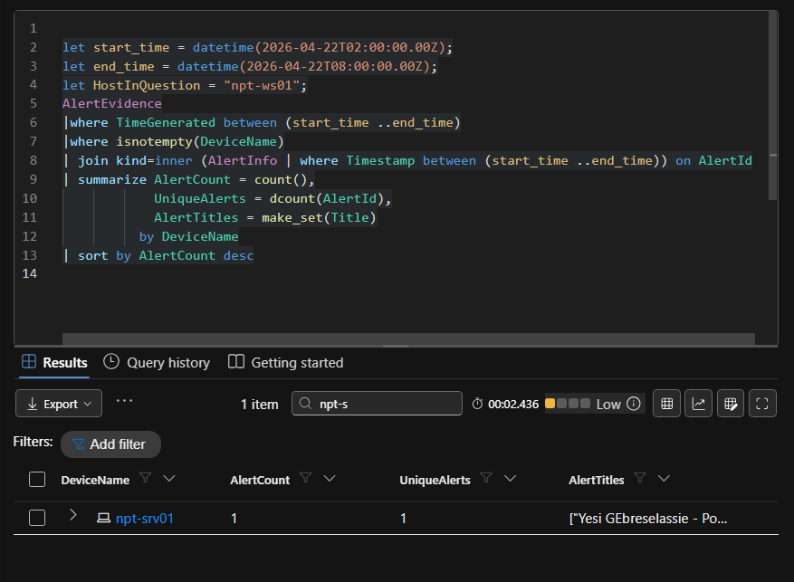

---

## MITRE ATT&CK Mapping

| Stage | Technique | ID |
|---|---|---|
| Initial Access | Valid Accounts | T1078 |
| Execution | Windows Management Instrumentation | T1047 |
| Persistence | Registry Run Keys | T1547.001 |
| Persistence | Scheduled Task/Job | T1053.005 |
| Persistence | Windows Service | T1543.003 |
| Privilege Escalation | Create Local Account | T1136.001 |
| Command & Control | Web Protocols | T1071.001 |
| Lateral Movement | Remote Services | T1021 |

## Indicators of Compromise

| Type | Value |
|---|---|
| Account (initial access) | `helpdeska` |
| Account (attacker-created) | `nexus_admin` |
| External IP | `20.110.92.50` |
| C2 domain | `updates.abordasync.website` |
| Dropped file | `C:\Windows\Temp\WindowsUpdate.exe` |
| SHA256 | `20cef6a013953890f9d38605d25d60dd63b42b09946bbb18ddb4a456da306e77` |
| Registry persistence | `WindowsHealthCheck` |
| Scheduled task | `GoogleUpdaterTask` |
| Service | `WindowsHealthSvc` |
| Secondary host | `NPT-SRV01` |

## Deliverables

- 📄 [Investigation Report](docs/investigation-report.md) — full timeline, impact, and scope
- 🛡️ [Containment & Remediation Plan](docs/containment-plan.md) — isolation, credential resets, IOC blocking, persistence removal
- 🔎 [Hunting Queries](queries/hunting-queries.kql) — the KQL used at each stage

## Repository Structure

```
.
├── README.md
├── docs/
│   ├── investigation-report.md
│   └── containment-plan.md
├── queries/
│   └── hunting-queries.kql
└── screenshots/
    └── 00–11 numbered evidence captures, one per stage
```

---

*This write-up documents a guided threat-hunting lab exercise built on
Microsoft Defender Advanced Hunting. Host names, accounts, and IOCs are
lab-generated and not tied to any real organization.*
